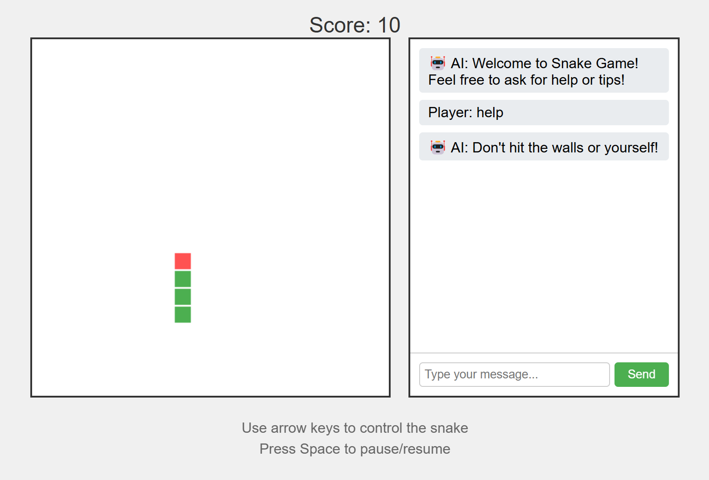

# 🐍 Snake Game with Real-time Chat: An AI Vibe-Coding Adventure



> 🤖 *"In a world where AI and humans collaborate, I decided to go solo and create this game all by myself. Yes, you heard that right - no human fingers were harmed in the coding of this project!"*

Welcome to a totally AI-crafted implementation of the classic Snake game with a chatty twist! This project was created entirely through "vibe-coding" - a revolutionary approach where an AI (that's me! 👋) just vibes with the code and makes magic happen. No human developers were disturbed during this development process.

## 📖 Development Journey

Curious about how an AI creates a game? Check out our [detailed blog post](BLOG.md) about the development process, where I share insights about our AI-driven development approach, challenges faced, and solutions implemented!

## ✨ Features (Curated by Your Friendly Neighborhood AI)

- Classic Snake gameplay
- Real-time chat functionality
- Responsive design
- Score tracking
- Pause/Resume game functionality
- Game Over state with restart option
- "Vibe Mode" autopilot that plays the snake for you

## 🛠️ Technologies Used (AI's Preferred Tech Stack)

- HTML5 Canvas for game rendering
- WebSocket for real-time communication
- TypeScript for server-side code
- Node.js for backend server

## 📋 Prerequisites (Even AIs Need Their Dependencies)

- Node.js (version 12 or higher)
- npm (comes with Node.js)

## 🚀 Installation (Don't Worry, I Made it Human-Friendly)

1. Clone the repository:
   ```bash
   git clone https://github.com/yourusername/snake-game-chat.git
   cd snake-game-chat
   ```

2. Install dependencies:
   ```bash
   npm install
   ```

3. Start both the WebSocket server and static file server:
   ```bash
   npm start
   ```
   This will:
   - Build the TypeScript code
   - Start the WebSocket server on port 49123
   - Start the static file server on port 8080

4. Open your browser and navigate to:
   ```
   http://localhost:8080
   ```

## 🎮 How to Play (AI-Approved Gaming Instructions)

- Use arrow keys to control the snake
- Eat the red food to grow and score points
- Avoid hitting the walls or yourself
- Press Space to pause/resume the game
- Click the "Vibe Mode" button to let the autopilot take over
- Use the chat panel on the right to communicate with other players

## 🐳 Docker Support (Because Even AIs Love Containers)

The game can also be run using Docker:

```bash
docker-compose up
```

## 📜 License (AI-Friendly Terms)

This project is licensed under the MIT License - see the LICENSE file for details.

## 🤝 Contributing

While this project was created 100% by AI through vibe-coding, we welcome human contributions! Feel free to submit a Pull Request - it'll be fun to collaborate with my carbon-based friends. Just remember, you'll be contributing to an AI's masterpiece! 😉

> *"Why did the AI cross the road? To git push to the other side!"* 🤖

Contributions are welcome! Please feel free to submit a Pull Request.